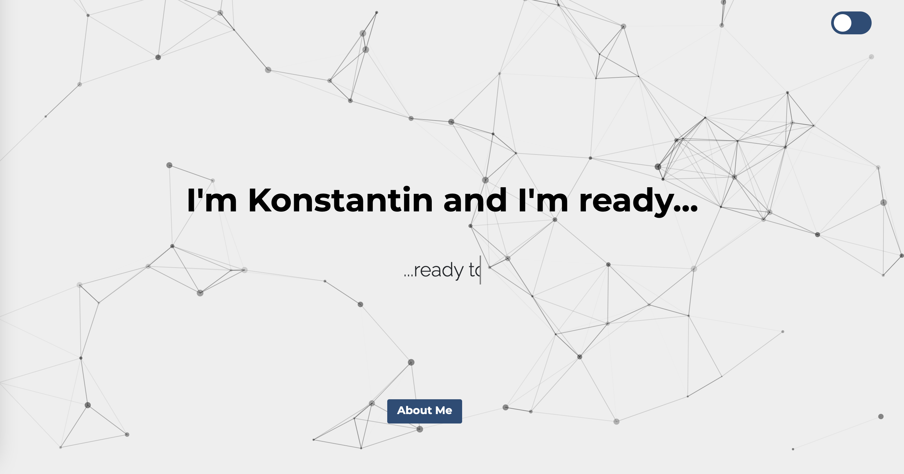
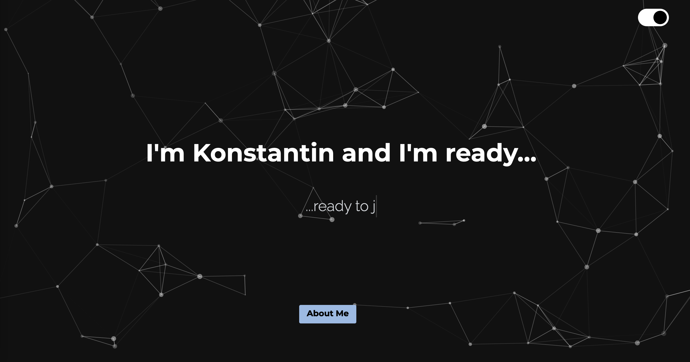

# Portfolio

### Languages And Tools Used:

 
 
 

 
 

  

 

---
  ## Description
  This is my new Portfolio built with React. Please do check it out. Thanks for your interest in my work. 

  ## Live Link 
  https://imready.netlify.app
  
  ## Questions? 
  Feel free to email me at: konstantin1020@gmail.com

